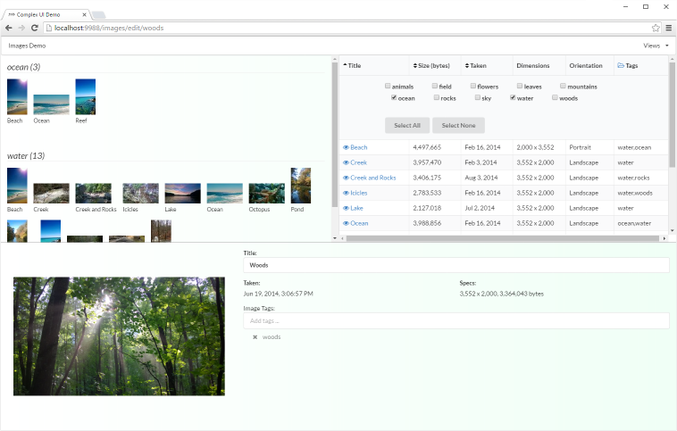

# Angular/Redux Complex UI Example
[](http://standardjs.com/)

Example of using Angular2 and Redux together to manage a "complex" user interface.



## Building and Running

```
git clone https://github.com/ng-cookbook/angular2-redux-complex-ui.git
cd angular2-redux-complex-ui
npm install
npm run build
npm run web
```

Then navigate to `http://localhost:9988/`

